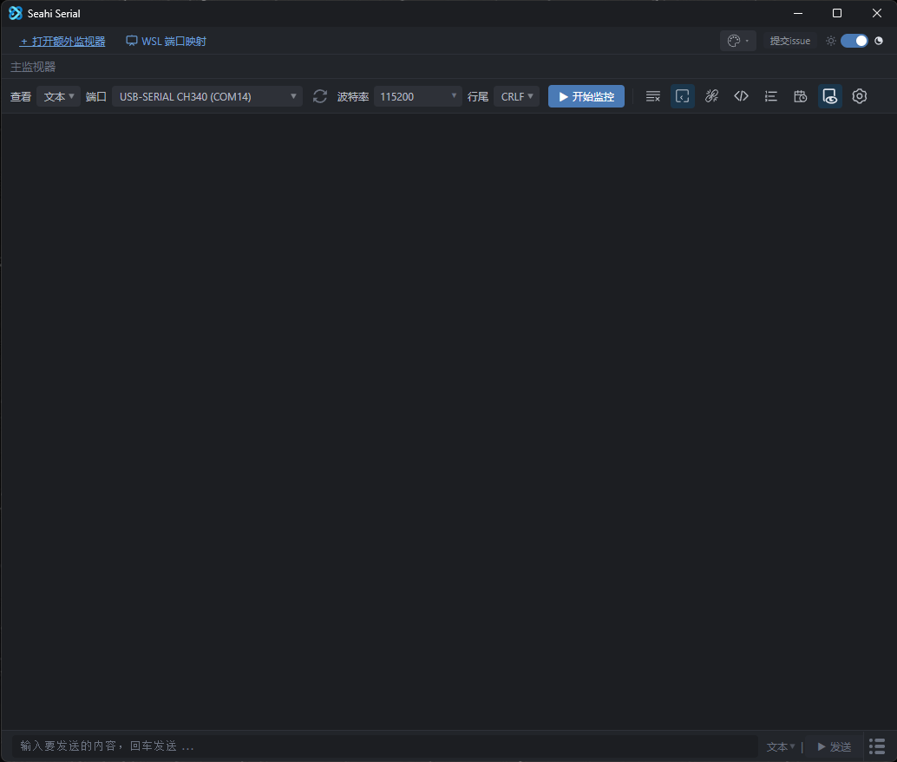
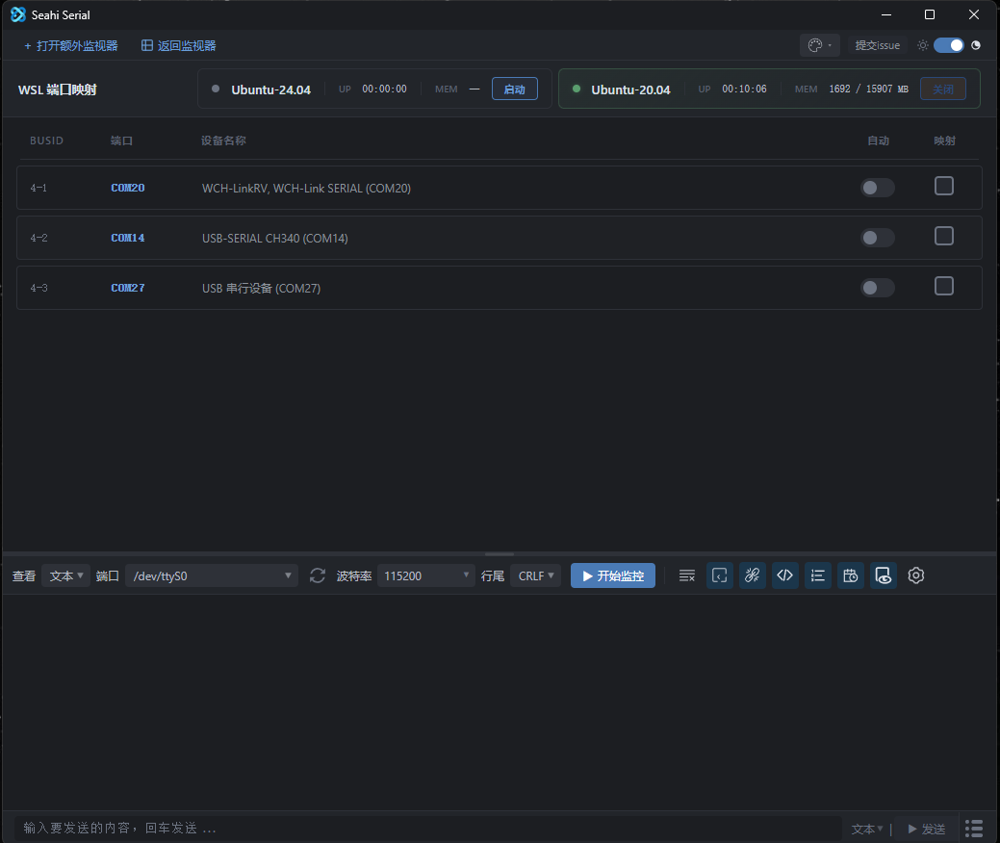

# SeaHi Serial

一款基于 **Tauri 2 + Rust** 的轻量级串口调试桌面工具，VS Code Serial Monitor 风格界面。


<div align="center">


</div>

## 功能特性

- **多串口同时连接** — 同窗口分栏显示，每个分栏独立操作互不干扰
- **完整串口配置** — 波特率（支持自定义输入）、数据位、停止位、校验位
- **DTR / RTS 实时切换** — 一键切换高低电平，适配不同硬件复位需求
- **发送历史记录** — 每栏独立保存最近 50 条发送记录，支持上下键快速回填
- **快速指令** — 自定义常用命令一键发送
- **ANSI 颜色解析** — 自动解析转义序列，以对应颜色显示
- **终端模式** — 输出区模拟终端交互
- **自动重连** — 串口断开后自动尝试重新连接
- **原生日志导出** — 通过系统文件对话框选择日志保存路径
- **12 种主题** — 6 种风格（默认、浮世绘彩、诗意东方、水墨丹青、桃之夭夭、金风玉露）× 深浅色
- **WSL 端口映射** — 通过 usbipd-win 将 USB 串口映射到 WSL 环境
- **WSL 串口监控** — 在 WSL 内直接调试串口设备
- **USB 设备插拔检测** — 设备插拔自动刷新列表
- **首次使用引导** — 9 步聚光灯引导，快速上手
- **自动更新** — 启动时检测 GitHub 最新版本

## 环境依赖

| 依赖 | 说明 |
|------|------|
| **Rust** | https://rustup.rs/ |
| **Node.js 18+** | https://nodejs.org/ |
| **Visual Studio Build Tools 2022** | 需勾选 "C++ 桌面开发" |
| **WebView2** | Windows 10/11 通常已预装 |

## 快速开始

```bash
# 克隆仓库
git clone git@github.com:SeaHi-Mo/Seahi-Serial.git
cd SeaHi-Serial

# 安装依赖
npm install

# 开发模式（热重载）
npm run dev

# 构建发布版 .exe
npm run build
```

构建产物位于 `src-tauri/target/release/seahi-serial.exe`

## 项目结构

```
serial-debugger-tauri/
├── src/
│   └── index.html                # 前端（单文件，~4400 行）
├── src-tauri/
│   ├── Cargo.toml                # Rust 依赖
│   ├── tauri.conf.json           # Tauri 应用配置
│   ├── capabilities/
│   │   └── default.json          # ACL 权限配置
│   ├── wsl-daemon/               # WSL bridge 脚本（base64 编码）
│   └── src/
│       └── main.rs               # Rust 后端（~1745 行）
├── skills/
│   └── seahi-serial-dev/
│       └── SKILL.md              # AI 开发技能指南
├── doc/                          # 项目文档
├── installer.iss                 # Inno Setup 安装脚本
└── TEST_CASES.md                 # 测试用例
```

## 技术栈

- **前端**：原生 HTML/CSS/JavaScript（无框架，单文件）
- **后端**：Rust + `serialport 3.3` + `winapi 0.3` + `windows-sys 0.59`
- **桌面框架**：Tauri 2
- **原生对话框**：`rfd 0.15`
- **WSL 桥接**：Python bridge 脚本 + `usbipd-win`

## 自动构建（GitHub Actions）

项目已配置 GitHub Actions 自动构建，推送版本 tag 后自动编译并创建 GitHub Release。

### 工作流配置

工作流文件位于 `.github/workflows/build.yml`，包含以下功能：

- **触发方式**：推送 `v*` 格式的 tag 时自动触发，也支持手动触发
- **运行环境**：`windows-latest`
- **缓存优化**：Rust 编译缓存，加速后续构建
- **自动发布**：构建完成后自动创建 Draft Release，附带 exe 安装包

### 如何使用

```bash
# 1. 修改版本号（同步更新以下 3 个文件）
#    - src-tauri/Cargo.toml      中的 version
#    - src-tauri/tauri.conf.json 中的 version
#    - installer.iss              中的 MyAppVersion

# 2. 提交并推送代码
git add -A
git commit -m "v0.x.x: 更新说明"
git push origin main

# 3. 创建并推送版本 tag
git tag v0.x.x
git push origin v0.x.x

# 4. GitHub Actions 自动开始构建
#    构建完成后会生成一个 Draft Release，进入 Releases 页面手动发布即可
```

### 手动触发构建

进入 GitHub 仓库 → **Actions** → **Build Release** → **Run workflow**，无需创建 tag 即可手动触发构建。

## 使用教程

### 界面总览

<div align="center">


</div>

界面分为以下区域：

| 区域 | 说明 |
|------|------|
| **全局操作栏** | 最顶部，包含「打开额外监视器」「WSL 端口映射」、主题风格选择、提交 issue 和深浅色切换 |
| **工具栏** | 串口配置区：查看模式、端口选择、波特率、行尾、开始/停止监控，以及图标按钮组 |
| **输出区** | 中间大面积区域，显示接收到的串口数据 |
| **发送栏** | 底部输入框，支持文本/HEX 模式、发送历史、快速指令 |

### 快速上手

#### 第一步：选择串口并连接

1. 插入串口设备（如 USB 转串口线）
2. 点击工具栏的 **端口** 下拉框，选择目标端口
3. 根据设备需求配置波特率（默认 115200）
4. 点击 **▶ 开始监控** 按钮

#### 第二步：接收数据

连接成功后，输出区会实时显示设备发来的数据。可切换查看模式（文本/HEX）、显示行号、时间戳。

#### 第三步：发送数据

在底部输入框输入内容，按 Enter 或点击发送按钮。支持文本和 HEX 两种发送模式。

#### 第四步：高级设置

点击齿轮按钮展开高级设置：数据位、停止位、校验位、DTR/RTS 控制、日志保存。

### 进阶功能

#### 多串口同时监控

点击 **＋ 打开额外监视器** 可添加新分栏，每个分栏独立配置、独立连接。

#### 快速指令

点击发送栏右侧的快捷指令按钮，配置常用指令一键发送。

#### 终端模式

点击终端模式按钮，输出区变为可编辑状态，直接打字发送。

#### WSL 端口映射

点击 **WSL 端口映射** 将 USB 串口映射到 WSL 环境，支持自动映射和手动映射。

#### 主题切换

支持 6 种风格 × 深浅色 = 12 种主题，点击全局栏的主题风格下拉和深浅色开关切换。

### 键盘快捷键

| 按键 | 功能 |
|------|------|
| `Enter` | 发送输入框内容 |
| `↑` / `↓` | 浏览发送历史 |
| `Escape` | 关闭历史下拉列表 |

## License

MIT
