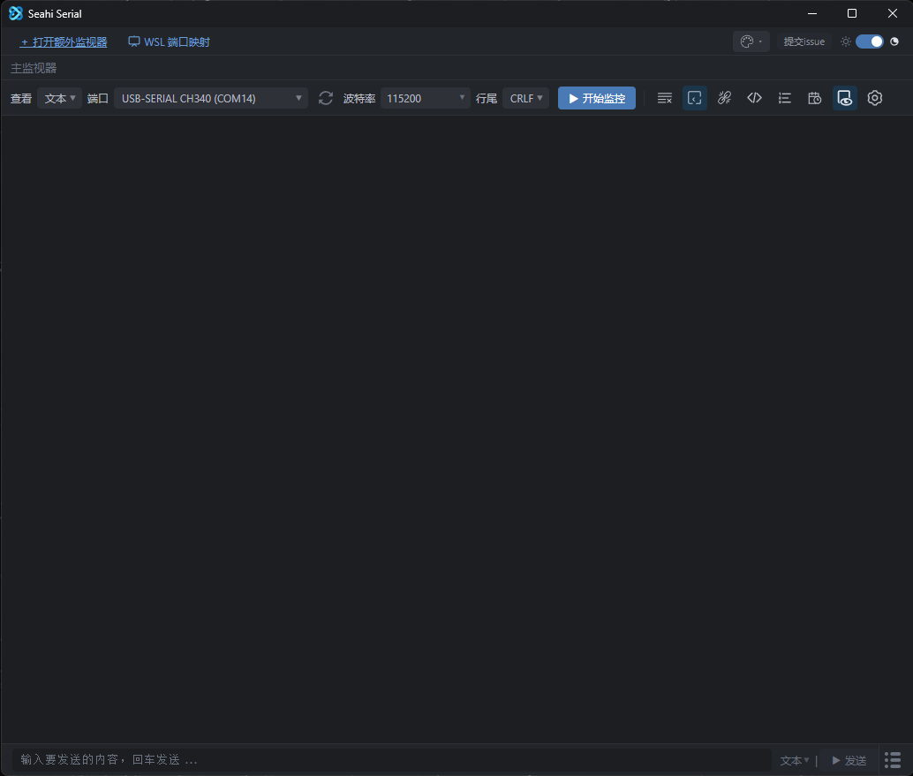
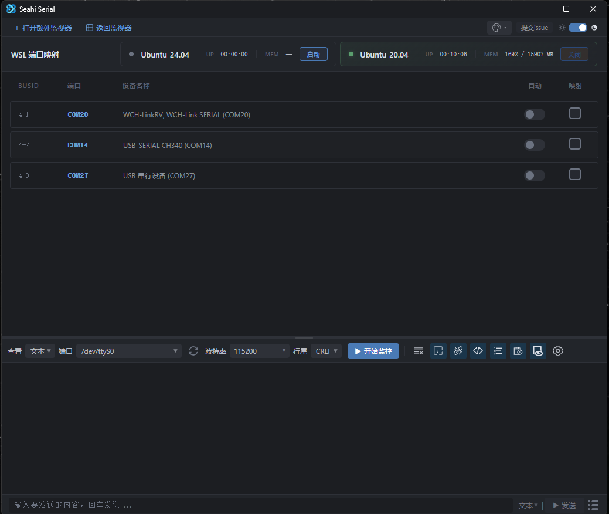

# SeaHi Serial

一款基于 **Tauri 2 + Rust** 的轻量级串口调试桌面工具，VS Code Serial Monitor 风格界面。


<div align="center">


</div>

## 功能特性

- **多串口同时连接** — 同窗口分栏显示，每个分栏独立操作互不干扰
- **完整串口配置** — 波特率（支持自定义输入）、数据位、停止位、校验位
- **DTR / RTS 实时切换** — 一键切换高低电平，适配不同硬件复位需求
- **发送历史记录** — 每栏独立保存最近 50 条发送记录，支持上下键快速回填
- **快速指令** — 自定义常用命令一键发送
- **ANSI 颜色解析** — 自动解析转义序列，以对应颜色显示
- **终端模式** — 输出区模拟终端交互
- **自动重连** — 串口断开后自动尝试重新连接
- **原生日志导出** — 通过系统文件对话框选择日志保存路径
- **日志隐形缓存** — 每次打开串口后如有收发内容，自动缓存本次会话日志，最多保留 10 个文件、新建时自动淘汰最旧的
- **12 种主题** — 6 种风格（默认、浮世绘彩、诗意东方、水墨丹青、桃之夭夭、金风玉露）× 深浅色
- **WSL 端口映射** — 通过 usbipd-win 将 USB 串口映射到 WSL 环境
- **WSL 串口监控** — 在 WSL 内直接调试串口设备
- **蓝牙调试（主机）** — 扫描周边 BLE 设备（含原始广播字节解析、设备类型识别、RSSI），连接后浏览 GATT 服务树并读写特征 / 描述符、订阅通知与指示、WinRT 配对
- **蓝牙调试（从机）** — 本机作为 BLE 外设对外广播，被手机 / 其它主机搜索并连接；内置 Nordic UART、FFE0 透传等预设，可收发主机写入、改可读值、向已订阅主机下发通知
- **USB 设备插拔检测** — 设备插拔自动刷新列表
- **MCP 服务器（AI 控制接口）** — 程序内置 Model Context Protocol 服务器（SSE 模式 / 仅监听回环），把串口、日志、界面控件暴露成 33 个内置工具（20 通用 + 13 串口语义）供 AI 客户端调用；工具操作**与前端界面实时同步**，调用记录写在独立的 `ai-calls.jsonl`，绝不污染用户配置
- **首次使用引导** — 9 步聚光灯引导，快速上手
- **自动更新** — 启动时检测 GitHub 最新版本

## 环境依赖

| 依赖 | 说明 |
|------|------|
| **Rust** | https://rustup.rs/ |
| **Node.js 18+** | https://nodejs.org/ |
| **Visual Studio Build Tools 2022** | 需勾选 "C++ 桌面开发" |
| **WebView2** | Windows 10/11 通常已预装 |

## 快速开始

```bash
# 克隆仓库
git clone git@github.com:SeaHi-Mo/Seahi-Serial.git
cd SeaHi-Serial

# 安装依赖
npm install

# 开发模式（热重载）
npm run dev

# 构建发布版 .exe
npm run build
```

构建产物位于 `src-tauri/target/release/seahi-serial.exe`

## 项目结构

```
serial-debugger-tauri/
├── src/
│   └── index.html                # 前端（单文件，~10400 行）
├── src-tauri/
│   ├── Cargo.toml                # Rust 依赖
│   ├── tauri.conf.json           # Tauri 应用配置
│   ├── capabilities/
│   │   └── default.json          # ACL 权限配置
│   ├── vendor/btleplug/          # btleplug 的 vendored fork（4 处本地补丁）
│   ├── wsl-daemon/               # WSL bridge 脚本（base64 编码）
│   └── src/
│       ├── main.rs               # Rust 后端（~7400 行）
│       └── mcp/                  # MCP 服务器（transport / protocol / bridge /
│                                 #   registry / loghub / calllog / aiconfig / mod）
├── npm/
│   └── seahi-serial-mcp/         # MCP 客户端配置安装器（零依赖 CLI）
├── skills/
│   └── seahi-serial-dev/
│       └── SKILL.md              # AI 开发技能指南
├── doc/                          # 项目文档（含 MCP.md / MCP_TOOLS.md / MCP_DESIGN.md）
├── TODO.md                       # **开发进度与待办**（当前状态实测快照 / 四批计划 / 阻塞项 / 待拍板）
├── installer.iss                 # Inno Setup 安装脚本
└── TEST_CASES.md                 # 测试用例
```

## MCP（AI 控制接口）

程序内置一个 **MCP（Model Context Protocol）服务器**，让 Claude Code / Claude Desktop / Cursor 等 AI 客户端直接操作本程序。

### 设计要点

| 项 | 说明 |
|------|------|
| **运行方式** | 与程序同进程（开箱即用，无需额外启动任何服务）；随程序启动自动监听 |
| **传输协议** | 仅 **SSE**（`GET /sse` 建立会话，`POST /messages` 发请求），**只监听回环地址** |
| **鉴权** | 每次请求必须携带 token（`?token=` 或 `Authorization: Bearer`）；`/healthz` 是唯一免鉴权端点，且只回 `{"ok":true}` |
| **显隐** | 顶栏 MCP 图标 → 弹窗内「启用 / 关闭」一键切换；开关状态保存到 `ai-config.json` |
| **配置隔离** | 用户配置 `config.json` **完全不受影响**；AI 相关设置与调用记录单独存放（见下） |
| **AI 调用效率** | 握手时通过 `initialize.instructions` 一次性下发工作方式（先看状态→串口主流程→错误码语义→上限），让 Agent 第一次就做对；错误信息里直接给出可选值/下一步工具；**没有设备或界面时立刻失败**（不白等轮询超时）；限流回包带请求 id（客户端能对上号，不会挂到超时） |
| **稳定性** | 会话数 / 队列长度 / 请求体大小 / 调用频率均有限额，空闲会话自动回收，日志中心按通道环形缓冲并有总量上限 |

### 内置工具（33 个：20 通用 + 13 串口语义）

| 分类 | 工具 |
|------|------|
| 应用信息 | `app_info`、`mcp_status`、`mcp_limits` |
| 串口语义（**优先用这些**，比按控件路径操作更准）| `serial_get_state`、`serial_list_ports`、`serial_select_port`、`serial_set_baud`、`serial_set_frame`、`serial_set_lines`、`serial_set_display`、`serial_open`、`serial_close`、`serial_send`、`serial_clear`、`serial_get_history`、`serial_get_output`、`serial_quick_cmd` |
| 界面控件 | `ui_list`、`ui_describe`、`ui_get`、`ui_set`、`ui_click`、`ui_get_state` |
| 日志中心 | `log_channels`、`log_tail`、`log_search`、`log_stats`、`log_clear`、`log_export` |
| MCP 自身 | `mcp_calls`、`mcp_stats`、`mcp_config_get`、`mcp_config_set` |

典型的串口主流程：`serial_get_state` → `serial_select_port` → `serial_set_baud` → `serial_open` → `serial_send` → `serial_get_output`（看设备回了什么）→ `serial_close`。

此外可选开启 `expose.autoControlTools`：程序启动时会扫描界面上的按钮 / 输入框 / 下拉框，按控件生成 `ctl_*` 工具（**默认关闭**——几百个工具会显著拖累模型选工具的准确率）。

### 文件位置

| 文件 | 内容 |
|------|------|
| `%APPDATA%\seahi-serial\ai-config.json` | MCP 服务器设置（开关、端口、token、暴露策略） |
| `%APPDATA%\seahi-serial\ai-calls.jsonl` | AI 工具调用记录（追加写，按大小轮转；默认不落盘，可在弹窗里开启） |
| `%APPDATA%\seahi-serial\mcp-endpoint.json` | 当前监听地址与 token（供安装器自动探测） |

### 客户端接入

```bash
# 一键写入客户端 MCP 配置（自动探测本机正在运行的程序实例）
npx seahi-serial-mcp install

# 只预览将要改动的内容，不落盘
npx seahi-serial-mcp install --dry-run

# 查看当前状态 / 卸载
npx seahi-serial-mcp status
npx seahi-serial-mcp uninstall
```

也可以在程序顶栏点击 MCP 图标，弹窗内直接复制「连接地址」与「安装提示词」手动配置。

> 详细使用说明见 [`doc/MCP.md`](./doc/MCP.md)；**33 个工具的完整参考（入参 + 返回结构）见 [`doc/MCP_TOOLS.md`](./doc/MCP_TOOLS.md)**；架构与设计取舍见 [`doc/MCP_DESIGN.md`](./doc/MCP_DESIGN.md)。

## 开发进度与待办

进度、当前状态与"卡在哪"都记在 **[`TODO.md`](./TODO.md)**（已纳入版本库），主要内容：

| 章节 | 内容 |
|---|---|
| 当前状态实测快照 | 33 个工具 / 182 个界面控件 / 会话与限流上限 / 日志中心容量 / 协议版本；外加三套测试的通过与真机一致性检查结果 |
| 语义工具四批计划 | 批次 1（串口 13 个）**已落地**；批次 2（BLE 主机 ~16）、批次 3（ADB/WSL ~16）、批次 4（全局 + 危险动作二次确认）待做 |
| ⛔ 阻塞项 | 串口的收发链路验证需要**真实串口设备**，当前没有设备（列了 H1~H7 与设备到位后的验证顺序）|
| 已知问题与技术债 | 构建警告、`log_export` 上限、Streamable HTTP 未实现等，逐条写明范围与修法 |
| 待拍板 | 需要产品决策的几项（危险动作确认策略、是否补 Streamable HTTP、协议版本广告等）|

> 逐次的技术细节（改了什么、为什么、怎么验证的）记在 [`doc/MCP_DESIGN.md`](./doc/MCP_DESIGN.md) §17「实施记录」。

## 技术栈

- **前端**：原生 HTML/CSS/JavaScript（无框架，单文件）
- **后端**：Rust + `serialport 3.3` + `winapi 0.3` + `windows-sys 0.59`
- **桌面框架**：Tauri 2
- **原生对话框**：`rfd 0.15`
- **WSL 桥接**：Python bridge 脚本 + `usbipd-win`
- **蓝牙**：`btleplug 0.13`（主机，vendored fork）+ `windows 0.62`（从机 / 配对）
- **MCP 服务器**：`hyper 1` + `hyper-util` + `http-body-util`（SSE，均随 `reqwest` 进入依赖树，无新增下载）

## 自动构建（GitHub Actions）

项目已配置 GitHub Actions 自动构建，推送版本 tag 后自动编译并创建 GitHub Release。

### 工作流配置

工作流文件位于 `.github/workflows/build.yml`，包含以下功能：

- **触发方式**：推送 `v*` 格式的 tag 时自动触发，也支持手动触发
- **运行环境**：`windows-latest`
- **缓存优化**：Rust 编译缓存，加速后续构建
- **自动发布**：构建完成后**直接发布正式 Release（latest）**，附带 MSI 与 exe 安装包
- **版本校验**：构建前先校验 tag 与 5 处版本号一致（不一致即失败，防止发出"版本号对不上"的包）

### 如何使用

```bash
# 1. 修改版本号（5 处必须一致，CI 会校验）
#    - src-tauri/Cargo.toml      中的 version
#    - src-tauri/tauri.conf.json 中的 version
#    - installer.iss              中的 MyAppVersion
#    - package.json               中的 version
#    - src-tauri/Cargo.lock       中 seahi-serial 条目的 version

# 2. 提交并推送代码
git add -A
git commit -m "v0.x.x: 更新说明"
git push origin main

# 3. 创建并推送版本 tag
git tag v0.x.x
git push origin v0.x.x

# 4. GitHub Actions 自动开始构建，完成后**直接发布为正式 Release（latest）**
#    无需手动操作（releaseDraft/prerelease/draft 均为 false）
```

### 手动触发构建

进入 GitHub 仓库 → **Actions** → **Build Release** → **Run workflow**，无需创建 tag 即可手动触发构建。

## 使用教程

### 界面总览

<div align="center">


</div>

界面分为以下区域：

| 区域 | 说明 |
|------|------|
| **全局操作栏** | 最顶部，包含「打开额外监视器」「WSL 端口映射」、主题风格选择、MCP 开关、提交 issue 和深浅色切换 |
| **工具栏** | 串口配置区：查看模式、端口选择、波特率、行尾、开始/停止监控，以及图标按钮组 |
| **输出区** | 中间大面积区域，显示接收到的串口数据 |
| **发送栏** | 底部输入框，支持文本/HEX 模式、发送历史、快速指令 |

### 快速上手

#### 第一步：选择串口并连接

1. 插入串口设备（如 USB 转串口线）
2. 点击工具栏的 **端口** 下拉框，选择目标端口
3. 根据设备需求配置波特率（默认 115200）
4. 点击 **▶ 开始监控** 按钮

#### 第二步：接收数据

连接成功后，输出区会实时显示设备发来的数据。可切换查看模式（文本/HEX）、显示行号、时间戳。

#### 第三步：发送数据

在底部输入框输入内容，按 Enter 或点击发送按钮。支持文本和 HEX 两种发送模式。

#### 第四步：高级设置

点击齿轮按钮展开高级设置：数据位、停止位、校验位、DTR/RTS 控制、日志保存。

### 进阶功能

#### 多串口同时监控

点击 **＋ 打开额外监视器** 可添加新分栏，每个分栏独立配置、独立连接。

#### 快速指令

点击发送栏右侧的快捷指令按钮，配置常用指令一键发送。

#### 终端模式

点击终端模式按钮，输出区变为可编辑状态，直接打字发送。

#### WSL 端口映射

点击 **WSL 端口映射** 将 USB 串口映射到 WSL 环境，支持自动映射和手动映射。

#### 主题切换

支持 6 种风格 × 深浅色 = 12 种主题，点击全局栏的主题风格下拉和深浅色开关切换。

#### 日志隐形缓存

每次打开串口，只要产生收发内容，程序都会**自动**把本次会话的日志缓存到磁盘（无需手动保存），一个会话对应一个缓存文件。

- **缓存位置**：`%APPDATA%\seahi-serial\log-cache`（即 `C:\Users\<用户名>\AppData\Roaming\seahi-serial\log-cache`）
- **文件命名**：`session-<时间戳>-<端口>.log`
- **保留数量**：最多 **10 个**文件，超出后新建文件时自动删除最旧的，始终保留最近 10 个
- **触发时机**：打开串口后有收发数据时才生成文件；整个会话无任何收发内容则不产生文件
- **内容范围**：缓存的是接收与发送的日志内容（不含系统提示/错误提示等界面消息）

在资源管理器地址栏粘贴上述路径即可查看缓存文件。

### 键盘快捷键

| 按键 | 功能 |
|------|------|
| `Enter` | 发送输入框内容 |
| `↑` / `↓` | 浏览发送历史 |
| `Escape` | 关闭历史下拉列表 |

## License

MIT
